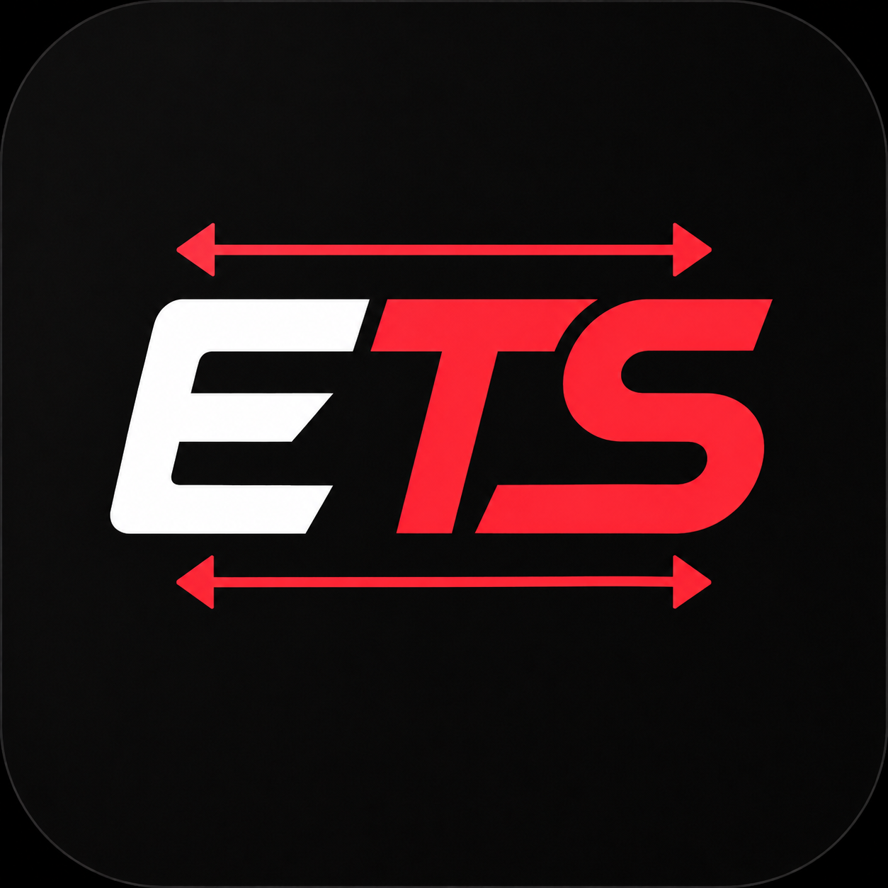

[](#)
[](#)
[](#)
[](#)

<p align="center">
  
</p>

# EasyTS

A simple Windows tool for VALORANT True Stretch. Switch your display to a stretched resolution in one click, and get your original resolution back automatically when VALORANT closes.

EasyTS handles the parts that are normally done by hand: switching your Windows display resolution, turning the Windows monitor driver off and on, restoring your resolution after you play, saving presets, and fixing black bars on some laptops.

---

## Preview

| Main page | Settings page |
|---|---|
|  |  |

---

## True Stretch in action

| Without True Stretch | With True Stretch |
|---|---|
|  |  |

Both screenshots use the same resolution (`1440x1080`). EasyTS switches your display to the stretched resolution for you.

---

## How it works

True Stretch makes VALORANT render at a resolution whose aspect ratio does not match your monitor's native one, then stretches the image to fill the screen. EasyTS does this at the display level:

1. You register your stretched resolution with your GPU driver once, as a custom resolution.
2. EasyTS turns off the Windows monitor driver, so VALORANT can no longer read your monitor's native aspect ratio.
3. Once you are in a match, you click a resolution in EasyTS and your display switches to it instantly.
4. When VALORANT closes, EasyTS puts your original resolution back.

EasyTS does not edit VALORANT's config files. Earlier versions did, and that method was removed in v4.0.0.

---

## Features

- One-click switching between popular stretched resolutions
- Custom resolutions and saved presets
- Automatic restore of your original resolution when VALORANT closes
- Monitor driver on/off from a single card, with administrator permission requested only when needed
- Live display card showing your current and original resolution
- Black bars fix for some laptop users through registry scaling
- Automatic WebView2 check with guided install if missing
- Automatic update checker on startup
- Lightweight standalone executable, no terminal required

---

## Download

[Latest release](https://github.com/ahhmilo/EasyTS/releases/latest)

---

## Installation

1. Download the latest `.exe` from the official GitHub releases page.
2. Move it somewhere accessible, such as `Desktop` or `Downloads`.
3. Run it directly.

No installer is required.

---

## Requirements

- Windows 10 or Windows 11
- A graphics driver that supports custom resolutions (NVIDIA Control Panel, AMD Software, or Intel Graphics Software)
- Administrator permission for the monitor driver switch and the black bars fix. EasyTS asks through a normal Windows UAC prompt.
- Microsoft WebView2 Runtime
- An internet connection when EasyTS starts, because its interface is loaded from GitHub

WebView2 is usually pre-installed on Windows 11. Some Windows 10 or stripped-down Windows installs may need it installed manually. EasyTS will prompt you automatically if WebView2 is missing.

---

## Setup (one time)

Do this before your first switch. The same guide is built into EasyTS under **Before you switch**.

1. **Register the resolution with your GPU.** Windows can only switch to resolutions your graphics driver already knows. Create each stretched resolution as a custom resolution in NVIDIA Control Panel, AMD Software, or Intel Graphics Software.
2. **Set GPU scaling to Full-screen.** In the same control panel, so the image fills the monitor. Not Aspect ratio, not Centered.
3. **Set VALORANT's display options.** Display Mode: **Windowed Fullscreen**. Aspect Ratio Method: **Fill**.
4. **Turn the monitor driver off in EasyTS**, before you launch VALORANT.

---

## How to use EasyTS

1. Open EasyTS and check that the **Monitor driver** card says **Off**.
2. Launch VALORANT and load into a match.
3. Alt-tab to EasyTS and click a resolution, or type one and press **Apply**.
4. Alt-tab back to VALORANT.
5. When you are done, close VALORANT. With EasyTS still open, your original resolution comes back automatically.

Switch once you are in a match. Menus and agent select can glitch at a stretched resolution.

### Auto-restore

When you switch resolution, EasyTS saves the resolution you were on. After VALORANT has been running and then closes, EasyTS puts that resolution back.

- Auto-restore only works while EasyTS is open. You can leave it minimized.
- If you close EasyTS while your display is still stretched, EasyTS warns you first.
- If EasyTS was closed while stretched, reopen it and press **Restore original**.
- You can turn auto-restore off in **Settings**. The **Restore original** button always works.

If your display is already at the resolution you pick, EasyTS does nothing.

### Presets

Type a resolution and click **+ Save current** to save it as a preset. Click a preset to switch to it instantly. Click the **x** on a preset to delete it.

---

## Monitor driver

The **Monitor driver** card turns the Windows monitor device(s) off and on. With the driver off, Windows no longer reports your monitor's native resolution to VALORANT, which lets a stretched resolution work.

- Turn it off **before you launch VALORANT**.
- It needs administrator permission. Your screen may flicker briefly.
- EasyTS does not turn it back on automatically. Turn it back on from the same card whenever you want your normal display behavior back.
- On some laptops, brightness controls stop working while it is off.

If something goes wrong and you cannot reach EasyTS, re-enable your monitor manually:

1. Right-click the Start button and open **Device Manager**.
2. Expand **Monitors**.
3. Right-click the disabled monitor and choose **Enable device**.

---

## Safety and transparency

EasyTS does not touch VALORANT. It does not read or write VALORANT's files, inject into the game, or read its memory.

EasyTS only does three things:

- Changes your Windows display resolution
- Turns Windows monitor devices off and on through standard Windows functionality
- Checks whether the VALORANT process is running, so it can restore your resolution when you finish

EasyTS does not:

- Inject into VALORANT
- Modify game files
- Interact with Riot servers
- Bypass Vanguard
- Change account data

EasyTS may be open while you play, since it needs to be running to restore your resolution afterwards.

Because EasyTS is unsigned independent software, Windows Defender or SmartScreen may show a warning. This is common for unsigned applications.

If SmartScreen appears:

```text
More info -> Run anyway
```

If you are uncomfortable running the tool, do not use it.

The source code is publicly viewable on GitHub for transparency.

---

## Coming from an older version?

Versions before v4.0.0 edited VALORANT's `GameUserSettings.ini`. v4.0.0 no longer does, and does not undo what older versions changed. Older versions also stored their data in `%localappdata%\EasyTS\`, and those files stay there untouched.

If you want to undo the old changes, with VALORANT closed:

1. Go to `%localappdata%\VALORANT\Saved\Config\` and open your account's folder, then `WindowsClient`.
2. If you used the **Read-only Config Lock**, right-click `GameUserSettings.ini`, open **Properties**, and untick **Read-only**.
3. Either delete `GameUserSettings.ini` (VALORANT recreates it, which resets your graphics settings), or replace it with a backup from `%localappdata%\EasyTS\Backups\`.

Your saved presets carry over. The old saved accounts and backups are no longer used, and you can delete them if you want.

---

## FAQ

### Why is True Stretch not working?

Check the following:

- The resolution is registered as a custom resolution in your GPU driver
- GPU scaling is set to **Full-screen**
- The monitor driver is **Off**, and you turned it off before launching VALORANT. If you turned it off after launching, restart VALORANT.
- VALORANT is set to **Windowed Fullscreen** with **Fill**
- You switched resolution after the match loaded
- If black bars appear, see the black bars question below

---

### EasyTS says Windows rejected my resolution.

That almost always means the resolution is not registered as a custom resolution in your GPU driver yet. Windows can only switch to resolutions the driver already knows. Add it in NVIDIA Control Panel, AMD Software, or Intel Graphics Software, then try again.

---

### Do I have to keep EasyTS open?

Only if you want your resolution restored automatically. Switching resolution works fine and stays applied if you close EasyTS afterwards, but you would then restore it yourself, either by reopening EasyTS and pressing **Restore original** or through Windows display settings.

---

### My monitor seems stuck disabled. How do I fix it?

Open EasyTS and press **Turn on** on the **Monitor driver** card. If EasyTS will not open, use the Device Manager steps in the **Monitor driver** section.

---

### My screen went black or looks wrong.

Wait a few seconds first. If it does not recover, press `Win + Ctrl + Shift + B` to reset the graphics driver, or change the resolution back in Windows display settings. EasyTS asks Windows for a live resolution change rather than saving it as your permanent display setting. Restarting your PC is the last resort.

---

### Black bars still appear. What should I do?

Some laptops and display setups show black bars because of GPU or display scaling behavior. EasyTS shows a **Fix Black Bars** card on systems where it applies. It changes the display scaling to Full Panel in the Windows Registry, needs administrator permission, and needs a restart afterwards. It may not work on every system.

You may also need to check your NVIDIA Control Panel, AMD Software, Intel Graphics Command Center, or monitor scaling settings.

---

### Why does EasyTS ask for administrator permission?

Only for the monitor driver switch and the black bars fix, because Windows requires administrator rights to change those. Switching resolution does not need it.

---

### Windows moved my desktop icons and windows.

That can happen whenever the display resolution changes, and EasyTS changes it. Restoring your original resolution usually brings things back close to where they were.

---

### Does it work with more than one monitor?

EasyTS changes the resolution of your primary display. The monitor driver switch applies to every monitor device Windows reports.

---

### Can I get banned?

EasyTS does not touch the game. It does not read or write VALORANT's files, inject into it, or interact with Riot services. It changes your Windows display resolution, turns monitor devices off and on, and checks whether the VALORANT process is running.

Use at your own discretion.

---

### Popular True Stretch resolutions

| Resolution |
|---|
| `1440x1080` |
| `1280x1024` |
| `1600x1080` |
| `1280x1080` |
| `1280x960` |
| `1154x1080` |
| `1080x1080` |

Each one has to be registered as a custom resolution in your GPU driver before EasyTS can switch to it.

---

### How do I uninstall EasyTS?

1. Press **Restore original** if your display is still stretched.
2. Press **Turn on** on the **Monitor driver** card if you turned it off.
3. Delete the executable.

EasyTS local data is stored in:

```text
%localappdata%\EasyTS\
```

You can delete that folder if you also want to remove your presets and settings.

---

### My question is not listed here

Open an issue on GitHub or contact me on Discord:

```text
xbzvx
```

---


## License

Copyright (c) 2026 ahhmilo. All rights reserved.

EasyTS is free to download and use from the official GitHub releases page.

The source code is publicly viewable for transparency, but this software is proprietary. You may not copy, modify, redistribute, reupload, repackage, sell, or publish modified versions of the source code or executable without explicit permission from the author.

You may share links to the official EasyTS GitHub repository or official GitHub releases page.
